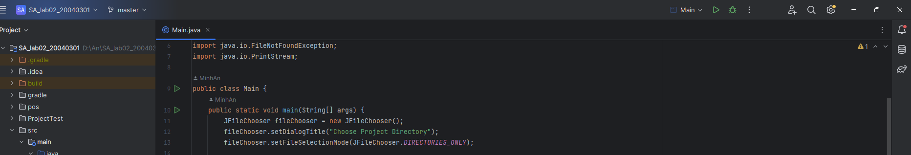
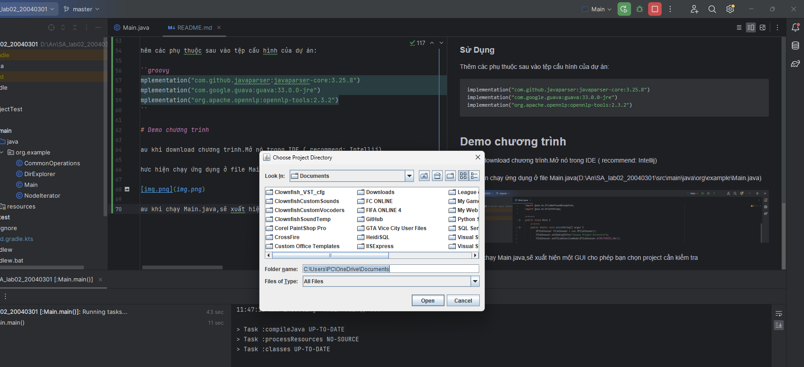
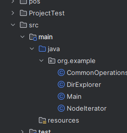
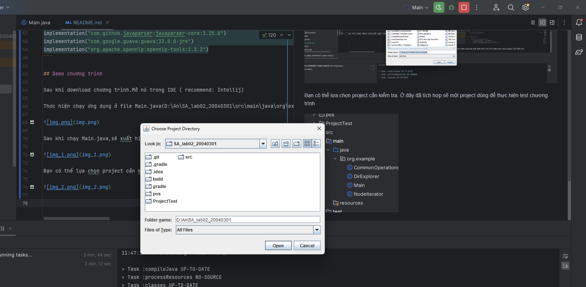
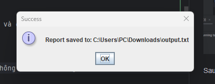
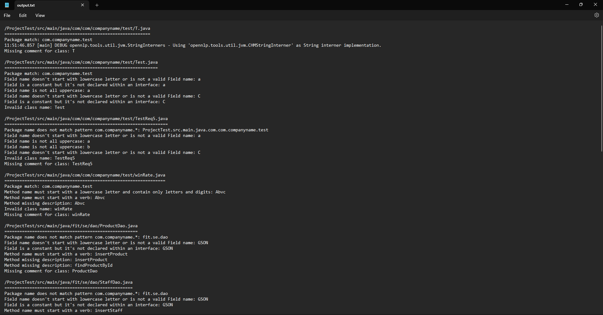
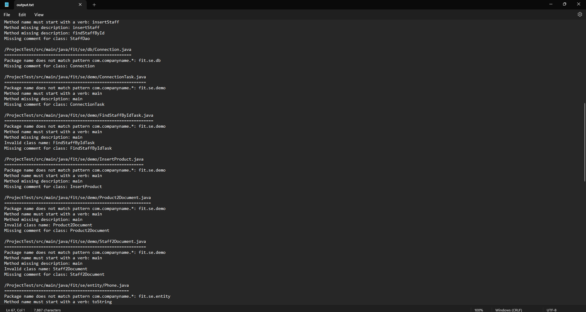
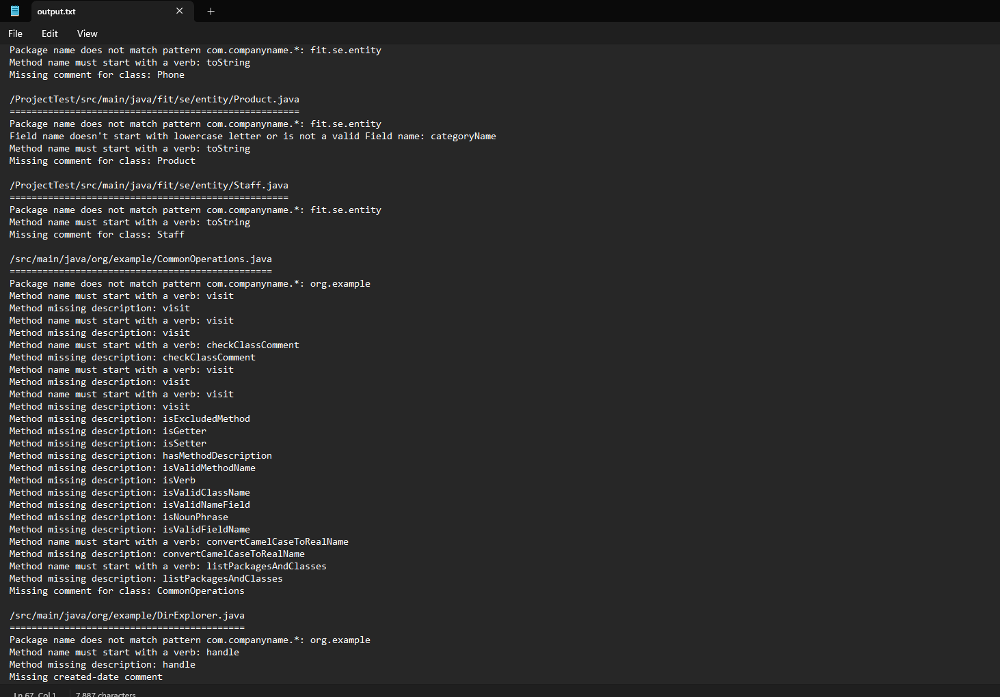
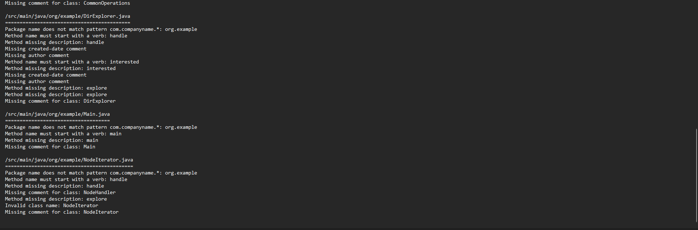

**# Lab 02 - Kiến trúc và Thiết Kế Phần Mềm

## Yêu cầu đề bài 
Viết một tool cho phép kiểm tra toàn bộ dự án và xuất ra report cho các trường hợp không thỏa mãn

Các nguyên lý được hướng dẫn như sau:
1. Các package trong dự án phải theo mẫu: com.companyname.* (*:tên bất kỳ)
2. Các class phải có tên là một danh từ hoặc cụm danh ngữ và phải bắt đầu bằng chữ hoa.
3. Mỗi lớp phải có một comment mô tả cho lớp. Trong comment đó phải có ngày tạo
   (created-date) và author.
4. Các fields trong các class phải là danh từ hoặc cụm danh ngữ và phải bắt đầu bằng một
   chữ thường.
5. Tất cả các hằng số phải là chữ viết hoa và phải nằm trong một interface.
6. Tên method phải bắt đầu bằng một động từ và phải là chữ thường
7. Mỗi method phải có một ghi chú mô tả cho công việc của method trừ phương thức
   default constructor, accessors/mutators, hashCode, equals, toString.

## Các bước thực hiện

 Để viết một công cụ kiểm tra dự án Java và xuất ra báo cáo về các vấn đề không tuân thủ quy định cấu trúc và tổ chức mã nguồn, chúng ta có thể sử dụng thư viện JavaParser để phân tích mã nguồn Java và áp dụng các quy tắc kiểm tra. Dưới đây là hướng dẫn cho việc triển khai công cụ này:

Bước 1: Tạo một công cụ JavaParser

Sử dụng JavaParser để phân tích các file mã nguồn Java.
Xây dựng các visitor để duyệt qua các thành phần của mã nguồn và kiểm tra các điều kiện đã nêu trong yêu cầu.
Xuất ra báo cáo cho các vấn đề không tuân thủ.

Bước 2: Duyệt qua dự án và áp dụng công cụ JavaParser

Sử dụng DirExplorer để duyệt qua tất cả các file mã nguồn Java trong dự án.
Đối với mỗi file Java, sử dụng công cụ JavaParser đã xây dựng để kiểm tra các điều kiện quy định.
Xuất ra báo cáo cho các vấn đề không tuân thủ.

Bước 3: Viết các visitor để kiểm tra các điều kiện quy định

Viết các visitor để kiểm tra mỗi điều kiện quy định (ví dụ: kiểm tra tên package, kiểm tra tên class, kiểm tra mô tả của lớp, kiểm tra tên field, kiểm tra hằng số, kiểm tra tên method, kiểm tra mô tả của method).
Override phương thức visit của visitor cho các nút AST tương ứng với các thành phần cần kiểm tra.
Trong phương thức visit, thực hiện kiểm tra điều kiện và xuất ra báo cáo cho các vấn đề không tuân thủ.

Bước 4: Xuất ra báo cáo

Khi phát hiện các vấn đề không tuân thủ, xuất ra báo cáo với thông tin chi tiết về vấn đề và vị trí trong mã nguồn.Báo cáo được xuất ra dưới dạng file output.txt và được lưu vào thư mục C:\Users\PC\Downloads

### Công Cụ và Thư Viện

- **Java Parser** ([https://javaparser.org/](https://javaparser.org/)): Sử dụng để phân tích cú pháp các tập tin mã nguồn.

- **Guava** (https://github.com/google/guava): Một thư viện Java cung cấp các tiện ích hữu ích và các cấu trúc dữ liệu tiêu chuẩn không có sẵn trong JDK.

- **Apache OpenNLP** (https://opennlp.apache.org/docs/) Dự án mã nguồn mở cung cấp các công cụ xử lý ngôn ngữ tự nhiên (NLP) cho các nhiệm vụ như phân loại văn bản, phân tích cú pháp và nhận dạng thực thể. Được sử dụng để chuyển đổi tên lớp và trường thành ngôn ngữ tự nhiên để kiểm tra theo yêu cầu cụ thể.

### Sử Dụng

Thêm các phụ thuộc sau vào tệp cấu hình của dự án:

```groovy
implementation("com.github.javaparser:javaparser-core:3.25.8")
implementation("com.google.guava:guava:33.0.0-jre")
implementation("org.apache.opennlp:opennlp-tools:2.3.2")
```

## Demo chương trình 

Sau khi download chương trình.Mở nó trong IDE ( recommend: Intellij)

Thưc hiện chạy ứng dụng ở file Main.java(D:\An\SA_lab02_20040301\src\main\java\org\example\Main.java)



Sau khi chạy Main.java,sẽ xuất hiện một GUI cho phép bạn chọn project cần kiểm tra 



Bạn có thể lựa chọn project cần kiểm tra. Ở đây đã tích hợp sẽ một project dùng để thực hiện test chương trình 



Sau khi chọn thành công project cần kiểm tra. Bạn nhấn open và đợi một vi giây để tools thực hiện kiểm tra 



Sau khi kiểm tra thành công, chương trình sẽ hiển thị một thông báo thành công và nơi lưu file báo cáo.



Ở file report output.txt sẽ hiển thị ra các thông tin về các đơn vị không phù hợp với các nguyên lý đã đề ra 







